  

<h1 align="center">
  
    SOLARAv3
  
   
  MOTEUR D'EXÉCUTION WINDOWS RÉVOLUTIONNAIRE
</h1>

<h3 align="center" style="font-weight: 300; letter-spacing: 3px; margin-top: -10px;">
  
  
</h3>

## Table des matières
- [Introduction](#solara-l'avenir-de-l-exécution-windows)
- [Fonctionnalités](#fonctionnalités)
- [Architecture Quantique Core](#-architecture-quantique-core)
- [Contribution](#contribution)
- [Licence](#licence)

## Solara : L'avenir de l'exécution Windows

Solara n'est pas un simple exécuteur Windows ; c'est un véritable jeu-changer. Créé par quiving, qui et une équipe d'experts en ingénierie inverse, Solara offre des performances et une fiabilité incomparables. Faites vos adieux aux ralentissements et accueillez une exécution sans faille.

## Fonctionnalités

- **Exécution sans Lag :** Profitez de performances fluides et sans ralentissements.
- **Sécurité Avancée :** Les techniques de chiffrement AES-256 et de morphing garantissent la sécurité de vos données.
- **Couverture Élevée :** 100% de couverture de l'API Roblox pour une fonctionnalité complète.
- **Latence Faible :** Une latence d'injection aussi basse que 0,9 ms pour des réponses rapides.
- **Interface Personnalisable :** Adaptez l'UI à vos besoins avec nos options de conception flexibles.
- **Support Multiplateforme :** Exécutez Solara sur Windows, macOS et Linux.

  

    
    
    
    
    
    
  

---

## 🌀 Architecture Quantique Core

```mermaid
graph LR
  A[Injecteur Quantique] -->|Découpe Temporelle| B[Routeur Photon]
  B --> C[Bouclier Entropique]
  C --> D[Débogueur Chronos]
  D --> E[Validateur Nébuleuse]
  E --> F[Moteur UI Astral]
  F --> G[Render Output]
  style A fill:#8a2be2,stroke:#00ffff
  style B fill:#00ffff,stroke:#00bfff
  style C fill:#ff00ff,stroke:#ff1493
  style D fill:#ff69b4,stroke:#c71585
  style E fill:#32cd32,stroke:#008000
  style F fill:#ffd700,stroke:#ffa500
  style G fill:#8a2be2,stroke:#00ffff
```

## Contribution
**Nous accueillons les contributions de la communauté ! Pour contribuer :**

- Forkez le dépôt.
- Créez une nouvelle branche : git checkout -b feature/your-feature
- Validez vos modifications : git commit -m 'Add some feature'
- Poussez vers la branche : git push origin feature/your-feature
- Ouvrez une Pull Request.
- Assurez-vous que votre code respecte nos normes de codage et inclut des tests appropriés.

## Licence
- Ce projet est sous licence QUANTUM_RPL_1.5 - voir le fichier LICENSE pour plus de détails.